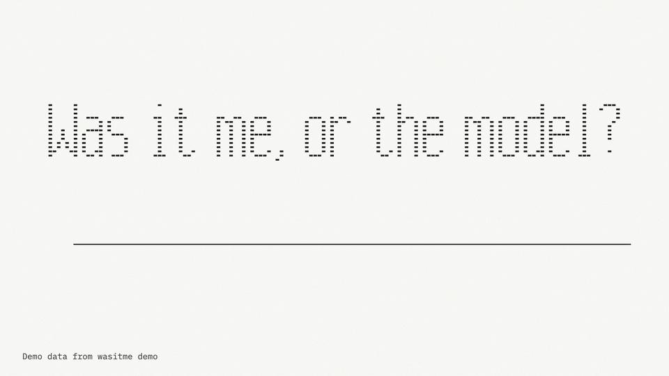
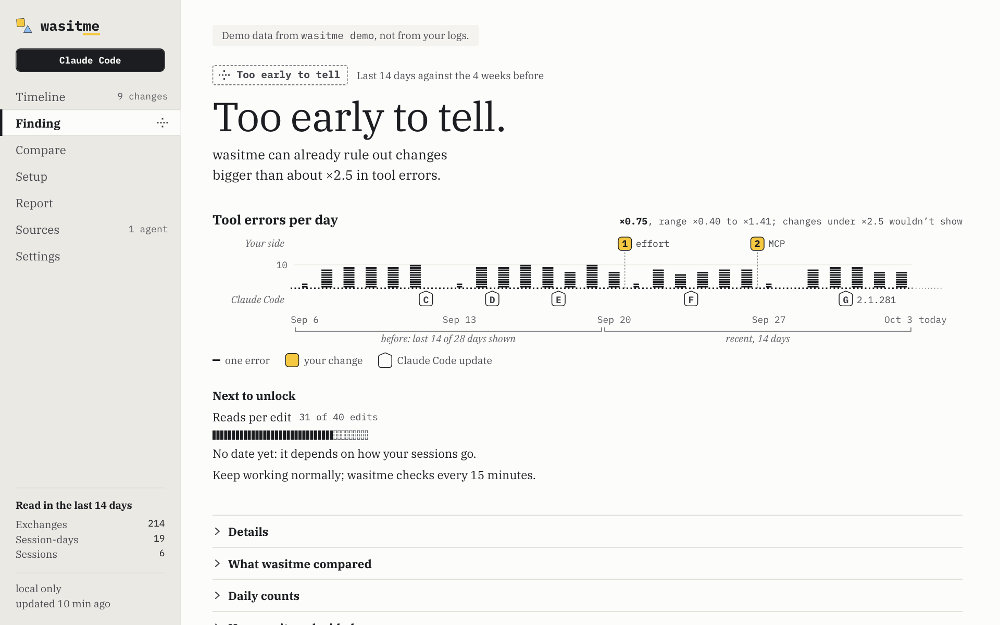

<h1 align="center">
  <picture>
    <source media="(prefers-color-scheme: dark)" srcset="design/system/glyphs/wordmark-dark.svg">
    
  </picture>
</h1>

<p align="center">
  <a href="https://draarivpatel-ui.github.io/wasitme/#film"></a>
  <br>
  <a href="https://draarivpatel-ui.github.io/wasitme/#film"><b>&#9654; Watch the 42-second film</b></a> &nbsp;·&nbsp; <a href="https://draarivpatel-ui.github.io/wasitme/">Website</a>
</p>

<p align="center"><em>Measure twice, blame once.</em></p>

**Was it me, or the model?** wasitme is a free, open-source tool that reads your own Claude Code and Codex session logs on
your Mac and builds a timeline of what changed on your side (model, effort, instruction files, MCP servers, skills) and on the
agent's side (version updates, which model was served). It then compares your recent weeks with the weeks before, and says
which side your numbers moved with only when the evidence supports it; otherwise it says "Too early to tell" and still
shows you the timeline.

<!-- hero image: the Control Center rendering `wasitme demo` (D21), marked as demo data on the page. Made by
     ui/scripts/hero.mjs; run it again whenever the canvas or the demo changes. -->
<picture>
  <source media="(prefers-color-scheme: dark)" srcset="docs/images/hero-dark.png">
  <source media="(prefers-color-scheme: light)" srcset="docs/images/hero-light.png">
  
</picture>

Early release (0.1.0). See [Status and known gaps](#status-and-known-gaps).

## What it reads, and what it never does

> **Local only.** No network code. Only the installer downloads, and only when you run it. No account, no telemetry.
>
> - **Reads:** your Claude Code and Codex session logs (read-only); a short list of each agent's configuration files, turned into
>   counts and hashes; and, at the start of a Claude Code session, a few fixed-name files in that project (hashed, then dropped).
> - **Keeps:** counts, durations, short allow-listed labels and salted hashes. **Never** prompt or reply text, tool input or output,
>   code, file paths, project names or secrets.
> - **Never opens** `auth.json` or `.credentials.json`, and never runs a hook, skill, MCP command or setting it finds.
> - **Anything you run inside Claude Code or Codex** (`/wasitme`, `/wasitme:report`) becomes part of that conversation and is
>   sent to Anthropic or OpenAI like any message. The report contains numbers only: no prompts, code or paths.
>
> Exactly what is read and kept: [docs/PRIVACY.md](docs/PRIVACY.md). Threat model and how to report a problem: [SECURITY.md](SECURITY.md).

**The Claude Code plugin has an in-session part, called a mod, that runs inside Claude Code with your permissions.** Claude
Code's install screen shows only a generic "Make sure you trust a plugin before installing" warning and nothing specific to
mods ([observed](docs/spikes/2026-10-04-claude-plugin.md)). So here is what wasitme's mod can do. It may call only:

```
calls: clock.every, clock.now, command.register, fs.read, fs.stat, state.get, state.set, ui.close, ui.open, ui.resolve
```

It reads one file (`~/.wasitme/glance.json`) and draws a pane and a one-line band. It cannot run programs, read your
environment, make requests, write files, or watch your prompts and tool calls. A check in CI
([`check-mod-allowlist.mjs`](scripts/check-mod-allowlist.mjs)) fails if the plugin's source reaches for any of those. The
exact list of calls is held by [`check-calls.mjs`](plugin/tests/check-calls.mjs), which needs the `claude` command and so
runs on a machine that has it rather than in CI; `claude plugin validate` prints the same list for you to compare.

## The five answers

Every surface uses the same words and the same mark: one line between two sides. Your changes sit above it (square), the
agent's below it (triangle).

| Mark | You see | It means |
|---|---|---|
| Dashed line, two dots | **Too early to tell** | Not enough data in both windows to compare yet. wasitme says what it can already rule out and what is missing. |
| Bare line | **No detectable change** | It compared, and changes bigger than about the stated size would have shown. |
| Square above, triangle below | **Can't tell which** | Your numbers moved, but wasitme can't say which side. It gives the reason: your work changed too, indicators moved in opposite directions, the logs don't say who changed something, or only a routine update landed. |
| Square above the line | **Your side** | Your numbers moved around the time of a change you made, and nothing recorded on the agent's side explains it. |
| Triangle below the line | **Agent side** | Nothing recorded changed on your side, and the agent's side did (a different model served, or an update that shows in several projects). |

Two more you may meet: **Timeline only** (findings for an agent are off until it passes wasitme's false-alarm test on synthetic
logs; Claude Code and Codex both have) and **Out of date** (the last scan is too old to call current).

**"Too early to tell" is common, on purpose.** One person's logs rarely hold enough data to separate a real change from noise,
and wasitme would rather say so than invent a cause ([D10](docs/DECISIONS.md), [D54](docs/DECISIONS.md)). It also
calls something a change only when two different kinds of indicator move the same way.

## Where you see it

- **Menu bar icon and popover.** The mark for the current state, with "+n" when new changes landed on the timeline. Click for the
  popover. Right-click for Check Again, Open wasitme, Show or Hide Desktop Panel, and Quit wasitme.
- **Desktop panel.** A small always-visible panel with the mark, the state and the latest change.
- **Control Center.** A window with the Timeline, the Finding, Compare (the two windows side by side), Setup, Report, Sources (what was read, whether the scan was
  sandboxed, which indicators paused and why) and Settings. The Report page copies a numbers-only evidence report or opens it as Markdown.
- **Claude Code.** `/wasitme` opens a pane. A one-line band above the prompt appears only when the finding is Your side or Agent
  side. A status line shows `wasitme: <state>`, and nothing else, with "+n" for new changes. The installer adds it only if you
  don't already have one and never touches yours. (If you run `wasitme statusline install --wrap` yourself, it keeps your line
  first and appends ours, saves a backup, and `wasitme statusline uninstall` puts your old line back byte for byte.)
- **Command line.** `wasitme` (the findings), `wasitme status` (one line), `wasitme report` (a shareable, numbers-only report: `--md`,
  the default, or `--html`), `wasitme demo` (sample output, clearly marked), `wasitme doctor` (add `--redacted` before pasting it into
  an issue), `wasitme exclude` (keep days, projects or entry points out of the analysis), `wasitme statusline`, `wasitme scan`.
  `--json` and `report --format json` give the machine-readable snapshot for your own tools. That file has exact times and local ids,
  so unlike the Markdown and HTML reports it is **not** safe to share.
- **Codex.** A skill: `$wasitme:report` prints the same report inside Codex. It is a skill only, with no hooks, and it needs the
  full install above because it runs the installed engine.

The menu bar app, desktop panel and Control Center are macOS only. The command line also works on Linux.

## Install

```sh
curl -fsSL https://github.com/draarivpatel-ui/wasitme/releases/latest/download/install.sh | sh
```

Or, more carefully, download the installer, read it, then run it:

```sh
curl -fsSLO https://github.com/draarivpatel-ui/wasitme/releases/latest/download/install.sh
less install.sh
sh install.sh
```

Read the installer before you run it, and know how much there is to read. [`scripts/install.sh`](scripts/install.sh) (about
300 lines) only fetches the release, checks it against the SHA-256 that the release's copy of this script carries, and hands
over to the installer inside it: the same script plus seven shell files in [`scripts/lib/`](scripts/lib/) (about 3,000 lines)
and two Node helpers, [`jsonutil.mjs`](scripts/lib/jsonutil.mjs) and [`from-app.mjs`](scripts/lib/from-app.mjs) (about 500
lines together; the second runs only for the Mac app's buttons). Those files do the actual installing and are what to read.
The folder's other two `.mjs` files serve the repository's own checks; the installer never runs them. `--dry-run` (with
`--from <folder>` for the full plan) prints every command and file write and changes nothing. Checksums: every release
lists the SHA-256 of each file it ships in its
[`SHA256SUMS`](https://github.com/draarivpatel-ui/wasitme/releases/latest/download/SHA256SUMS) (they catch a corrupted download, not
a compromised source); `shasum -a 256 --ignore-missing -c SHA256SUMS` checks the files you downloaded next to it, and
`gh attestation verify install.sh --repo draarivpatel-ui/wasitme` checks that this repository's release workflow built the file.

It needs **Node.js 22 or newer** ([D24](docs/DECISIONS.md)), and it asks before each step, one at a time:

- the engine and the `wasitme` command (`~/.wasitme/versions/<version>`, one link at `~/.wasitme/current`);
- the **menu bar app**, built on your Mac from source and signed ad hoc (no Apple Developer account, so no prebuilt binary
  is shipped; [D7](docs/DECISIONS.md)). It needs Swift 6 tools (Xcode 16 or Command Line Tools 16, or newer). Without them the
  rest still installs;
- a **background scan every 15 minutes** (a macOS LaunchAgent, run in the Node sandbox when your Node supports it);
- the **Claude Code plugin** (pane, band, session hooks, `/wasitme:report`);
- the **status line**, only if you have none;
- the **Codex skill**.

It never uses `sudo`, never changes `xcode-select`, and edits a shell profile only if you say yes to adding a `PATH` line (backed
up first). `--dry-run` prints everything it would do and changes nothing. `sh scripts/install.sh --help` lists the rest. macOS may
show a "Background Items Added" notice for the scan job.

| Platform | Command line | Background scan | Hooks, plugin, status line | Mac app |
|---|---|---|---|---|
| macOS, Apple silicon | yes | yes | yes | built locally |
| macOS, Intel | yes | yes | yes | builds for the host; untested |
| Linux | yes | none: scans when you run it | hooks do nothing, harmlessly | none |
| Windows | not supported until the npm package is published ([D16](docs/DECISIONS.md)) | | | |

Tested on macOS 27 on Apple silicon. Older macOS versions (the app is built for 14 and up) and Swift 6.0 or 6.1 toolchains are untested.

## Day one

Findings are on for both agents: on synthetic logs, Claude Code and Codex both passed the false-alarm test that turns findings
on. Some of the other calibration checks were not repeated on the final version of the rules (see
[docs/METHOD.md](docs/METHOD.md#status-at-a-glance)). So a new install does not say "Timeline only". It says **Too early to tell**, with what
is still missing, and the timeline works from day one:

- It is built from your logs retroactively (version, model, effort, mode and the `/model` and `/effort` commands in them) and from
  snapshots of your configuration from the day you install (instruction files, MCP servers, skills, plugins, hooks).
- Claude Code's own cleanup deletes old terminal transcripts after 30 days by default (its `cleanupPeriodDays` setting;
  [research notes](docs/research/03-claude-code-plugins-mods.md)). wasitme keeps the derived numbers, so your history outlives them.

**"Too early to tell" is the normal answer for a while.** A comparison needs the last 14 days against the 28 before (so 42 days of
history), and in each window at least 10 events, 10 session-days and 5 sessions, with no single session supplying half. wasitme shows what
is still missing as counts ("31 of 40 edits so far"). It does not predict a date: its date estimates failed their own accuracy test for
people with a few very long sessions, so v1 shows none ([D66](docs/DECISIONS.md)).

## How it decides, in short

It compares indicators (tool errors, reads per edit, edits without reading first, with interruptions and pushback shown beside them
but never deciding) between a recent window and the longer window before. Each comparison prints a **range**: where the true ratio
could plausibly be at this volume of data. It calls a change only when at least two different kinds of indicator
moved the same way and none moved the other way. Then it asks what else changed around that time, on each side, and says which
side only when the recorded evidence points one way. Routine agent updates alone are never enough.

The full method, every gate, the confounders it checks, and the status of its calibration numbers are in
[docs/METHOD.md](docs/METHOD.md). On synthetic users followed for 90 days of always-on use, with no real change in either side, none of
7,000 (1,000 in each of seven profiles) saw a false change or a false agent-side finding. The 95% upper bound is 0.37% for each profile,
against limits of 6% and 2%. Those users are made up: it shows the rules behave as designed, not that real logs behave the same way.

## Honest limits

- **Indicators, not answer quality.** Counts of tool errors, reads and edits say nothing about whether answers were good. Every
  finding ends with: "These indicators don't measure answer quality. Evidence, not proof."
- **One person rarely gets a finding.** Power is low for a single user. In wasitme's own synthetic tests, a planted doubling is found
  in 34 to 39 of 40 runs for users with many short sessions and ordinary failure rates (three profiles that differ in how the
  sessions are spread over projects) and in only 7 to 10 of 40 for users with a few very long sessions, sparse failures, or Codex
  (numbers in [METHOD.md](docs/METHOD.md#what-the-calibration-runs-so-far-show)).
- **Codex has no hooks,** so some days are never fully observed, and a planted doubling was found in only 9 of 40 Codex runs.
- **Plugin-only and `--until` reports leave out your configuration history.** They run read-only: they do not load the saved history of
  instruction-file, MCP, skill and hook changes or the project snapshots. They can therefore differ from what the app and the plain
  command line show, and they cannot call a change "Agent side" by elimination, which needs fully observed days.
- **Sessions on other machines aren't visible.**
- **Pushback detection is English-only,** and it supports a finding but never decides one.
- **Logs change without notice.** When an agent changes its log format, the records wasitme cannot read are counted and shown on
  the Sources page, never guessed at, and fixes ship as soon as practical. There is no patch SLA.
- **Reports pasted into Claude or Codex go to that vendor,** like any message.
- **No benchmarks, no cost tracking, no cloud.** It reads your logs and does nothing else.

## Update and uninstall

**Update.** Run the install command again, which fetches the latest release
(`curl -fsSL https://github.com/draarivpatel-ui/wasitme/releases/latest/download/install.sh | sh`), or end it with `| sh -s -- --update`
instead of `| sh` to keep exactly the parts you have and be asked nothing. The new version is unpacked beside the old one and one link is flipped, so the
engine and both plugins move together; the previous version is kept for a rollback. The Mac app is rebuilt, and if it was
running it is quit and started again in the background (`--no-relaunch` leaves it closed). If a new plugin version would call
or hook more than the installed one, the update stops (exit 4) and shows the difference. Only the release's own `install.sh`
carries a checksum: an update run from the installed copy (`--update` with no source, or the Mac app's Update button) downloads
the latest release over HTTPS with no checksum to compare. To check one, give it the release tarball's address with `--url`
and its SHA-256 from that release's `SHA256SUMS` with `--sha256`.

**One part at a time.** `sh ~/.wasitme/current/scripts/uninstall.sh --only codex-plugin` removes just that part (also `app`,
`scan-agent`, `claude-plugin`, `statusline`) and keeps the rest; `sh ~/.wasitme/current/scripts/install.sh --add codex-plugin`
puts it back. `wasitme history clear` deletes your saved numbers but keeps wasitme installed, with your settings and exclusions.

**Uninstall.** `sh ~/.wasitme/current/scripts/uninstall.sh` asks before removing each part (Claude Code plugin, status line,
Codex skill, background scan and app, the `PATH` line, the command). It restores your status line only if it is still
wasitme's, keeps your saved numbers unless you add `--purge`, and never touches your agent logs.
[docs/PRIVACY.md](docs/PRIVACY.md#how-to-delete-everything) lists everything that can be deleted.

## Status and known gaps

This is an early release.

- Both agents are calibrated on synthetic logs only. Not yet measured: how often the rules misfire on real logs, the coverage of the printed
  range, and, on the final decider, the attribution limits, the smallest-detectable-change check and the standard-error check
  ([METHOD.md](docs/METHOD.md#status-at-a-glance)).
- The Codex skill (`$wasitme:report`) is not yet confirmed on a real Codex login ([D49](docs/DECISIONS.md)).
- Whether the status line shows in Claude Desktop is unverified.
- Windows is unsupported, Intel Macs and older macOS versions are untested.

## Project

[Contributing](CONTRIBUTING.md) (a new agent reader must come with synthetic fixtures), [Security](SECURITY.md),
[Code of Conduct](CODE_OF_CONDUCT.md), [Formats](docs/FORMATS.md), [Third-party notices](THIRD_PARTY_NOTICES.md).

**License:** [MIT](LICENSE), Copyright (c) 2026 Aariv Patel. Free to use, change and share ([D2](docs/DECISIONS.md)).

**Credits.** The metrics in this genre started with one user's before-and-after analysis of thousands of Claude Code sessions,
[anthropics/claude-code issue #42796](https://github.com/anthropics/claude-code/issues/42796). Other projects shaped the ideas and the bugs to
avoid, and are credited in [THIRD_PARTY_NOTICES.md](THIRD_PARTY_NOTICES.md); no third-party code has been copied. Type is IBM Plex
Serif and Plex Mono under the SIL Open Font License.

wasitme is an independent project, not affiliated with or endorsed by Anthropic or OpenAI.
